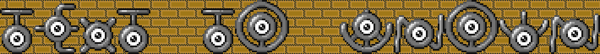

# Text2Unown

A small command-line program to generate an unown image from a string

## How To Use

This program requires Pillow, if it is not installed you can do such using `python -m pip install Pillow`
or `python -m pip install -r requirements.txt`

To run the program: `python text2unown.py -t "text to be unowned"` and `python text2unown.py -h` to list optional arguments
